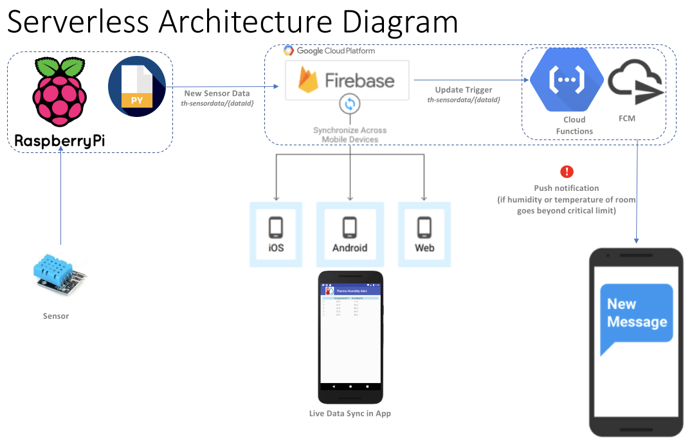
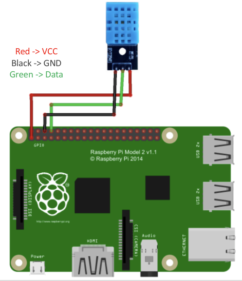

# Android app to demonstrate Certificate Pinning
####                                                                                                     By Manoj Kumar
## Introduction 
‘Thermo-Humidity Alert’ app is an IOT base software that alert you if humidity or temperature of you room/home goes in critical territories. This app provide cloud base live monitoring capabilities from remote.

## Use Case
In winter people use heater and humidifier but they do not have monitoring system for healthy limits for temperature and humidity. So this IOT base android app will fulfill their need. Even user can monitor their kids room condition remotely.

## Product Functions
•	Live Temperature and Humidity monitoring
•	Remote monitoring
•	Data saves in firebase cloud 
•	Alerts for critical boundaries for temperature and humidity
•	Can get alerts even app is closed.
•	High performance with serverless

## How to Run
1.	Prerequisite: Android Studio, Raspberry pi3, 3 pin temprature humidity sensor, with basic knowledge of Android, Java, Python, Node.js, Firebase and Google Cloud.
2.	Download or clone project code and open in Android studio.
3. It has 3 application
  ->1. Firebase_SensorNotificationFunction - Google Firebase Cloud Function
  ->2. RaspberryPi_Code - Python raspberry pi code to get sensot data and insert in firebase db
  ->3. Android_GoogleCloudFirestore - Android App
  
  ### 1.	Firebase_SensorNotificationFunction - Follow tutorial to deploy Cloud function. It will involve install firebase,     login, deploy. 
    
  ### 2.	RaspberryPi_Code - Follow tutorial to deploy Cloud function. 
    
  ### 3. Android_GoogleCloudFirestore - Open and run in android studio.

## Technologies Used
1.	Java.
2.	Android Studio
3.  Python
4.  Node.js
5.  Firebase and Google Cloud

## Architecture 
Serverless Architecture for live update and notification. 

RecyclerView Components. 

## User Interfaces
### Live sensor data scream to app

 
### Notification Alerts

Notification when humidity recorded as 70% which is higher then limit of 50%. Temperature critical zone start at 80F°.

## Hardware Interfaces
Python program is interacting with sensor and feeding data to firebase cloud.
### Sensor wiring:
Sensor is wired as follows with raspberry pi3.
3.3V – VCC
GND – GND
GPIO14 -- DATA

 
#### Introduction to Raspberry Pi i/o pin 
1. Raspberry Pi i/p pins are located in the upper left corner of board, see following picture:
pi-pin-picture

2. These pins are combination of Voltage supplies, Grounds and GPIO (general purpose input/output) pins. You can distinguish them from following graph:
pi-gpio-diagram

3. Understand those pins functions are fundamental to design projects which allow Raspberry Pi to communicate with sensors and many other devices.
Detail explanation of pins:

 
### Python console for sensor data:
Sensor data which should be synced to firebase database.
 

## Software Interfaces
### Firebase Database

### Cloud Firebase Function

## Refrence
- [*Pro Android 5*](https://github.com/Apress/pro-android-5) by Dave MacLean, Satya Komatineni, and Grant Allen (Apress, 2015)
- [*How to set up temperature and humidity sensor (DHT11) on raspberry Pi*](http://kookye.com/2017/06/01/%E6%A0%91%E8%8E%93%E6%B4%BE%E8%AF%BB%E5%8F%96dht11/)

## Thank You
#### [*Manoj Kumar*](https://www.linkedin.com/in/manojkumar19/)
#### Solutions Architect

